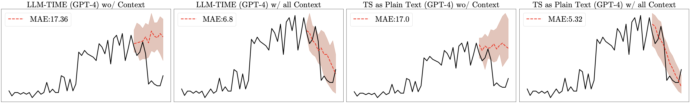

# Context Aid Forecasting -- Struggle Yet, But Has Potential

## 🛠ENVIRONMENT SETUP

To set up your environment for "Context Aid Forecasting", you'll need to follow the instructions in the `install.sh` script. This script will guide you through installing all the necessary dependencies.

To use the GPT-4 API, please add your key to the environment variables.

`export OPENAI_API_KEY=<your api key>`

Please add the OpenAI base URL to the environment variables.

`export OPENAI_API_BASE=<your base url>`

## 🚀Run Forecasting Scripts
Before running, Please add the project path to the environment variables. 

`export PYTHONPATH="${PYTHONPATH}:<your base path>/test_aid_forecast/"`

### LLM-TIME (GPT-4) wo/ Context

Utilizes the LLMTIME method to forecast without prepending context. This is useful for establishing a baseline performance for comparisons.

`./script/llmtime_wo_context.sh`

### LLM-TIME (GPT-4) w/ all Context

Employs the LLMTIME to forecast with entire available captions. This method assesses the full potential of LLM contextual reasoning.

`./script/llmtime_wi_all_context.sh`

### LLM-TIME (GPT-4) w/ Context 

Investigates the influence of different captions as context on the forecasting outcome. 

`./script/llmtime_wi_captions.sh`

### TS as Plain Text (GPT-4) w/ or wo/ Context

This method uses the original Large Language Model (LLM), bypassing the LLMTIME approach, to forecast while maintaining the original data scale. It provides insight into the impact on LLM's reasoning ability when the descriptions in captions are consistent with the data scale.  

`./script/llm_ori_scale.sh`

### 📚Tips
The "visualize.ipynb" file and outputs contain an time sereis example result to help visualize the outcomes.
